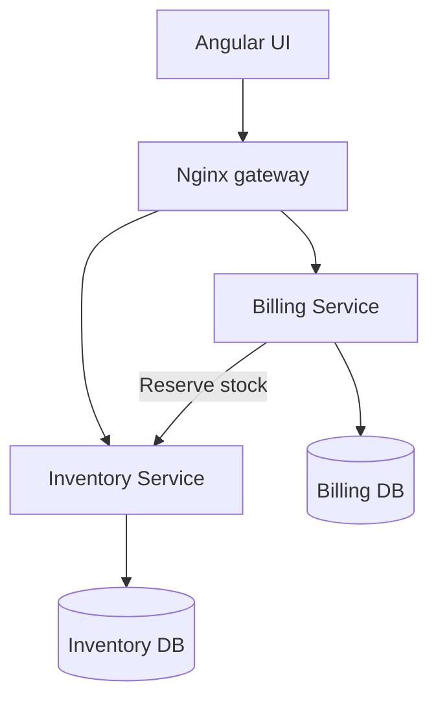

<p align="right"><a href="./README.pt-BR.md">Português 🇧🇷</a></p>

# NotaFlow - Invoice and Inventory System

A full-stack invoice issuance platform built for the Korp technical challenge. The solution uses an Angular interface, two ASP.NET Core microservices and PostgreSQL, with special attention to consistency, resilience and usability.

## Highlights

- Product registration and stock management
- Invoices with sequential numbering and multiple products
- Open and Closed invoice lifecycle
- Atomic stock deduction during invoice printing
- Concurrency control against overselling
- Idempotent printing to prevent duplicate stock deductions
- Retry and friendly feedback when the Inventory service is unavailable
- Interactive failure simulation from the interface
- Responsive administrative dashboard
- Swagger/OpenAPI documentation for both APIs
- Docker Compose startup and automated CI

## Architecture



Each microservice owns its database. The Billing service never changes Inventory tables directly; stock changes are performed through the Inventory API.

## Technology stack

- Angular 19, TypeScript and RxJS
- C# and ASP.NET Core 8
- Entity Framework Core and LINQ
- PostgreSQL 16
- Docker and Docker Compose
- Nginx
- xUnit and GitHub Actions

## Run locally

Requirements: Docker Desktop with Docker Compose.

```bash
cp .env.example .env
docker compose up --build
```

Open:

- Application: `http://localhost:4200`
- Inventory Swagger: `http://localhost:8081/swagger`
- Billing Swagger: `http://localhost:8082/swagger`

Stop the environment:

```bash
docker compose down
```

To also remove local database data:

```bash
docker compose down -v
```

## Demonstrating failure recovery

1. Create a product with available stock.
2. Create an invoice containing that product.
3. Enable **Failure demonstration mode** on the invoice page.
4. Click **Print**.
5. The interface reports that Inventory is unavailable, while the invoice stays Open and stock remains unchanged.
6. Disable the mode and print again. The invoice is closed and stock is deducted once.

Repeated print requests are safe: the stable operation key `invoice-{id}` makes Inventory return the original successful result without applying the deduction again.

## Automated checks

```bash
dotnet test Korp.InvoiceSystem.sln
cd frontend && npm ci && npm run build
```

With the Docker environment running:

```bash
chmod +x scripts/smoke-test.sh
./scripts/smoke-test.sh
```

## Documentation

- [Technical details](./docs/TECHNICAL_DETAILS.md)
- [Presentation video script](./docs/VIDEO_SCRIPT.md)
- [API examples](./docs/API_EXAMPLES.md)

## Security notes

- No credentials or real user data are committed.
- `.env` is ignored and `.env.example` contains development placeholders only.
- The example password must be changed outside a local demonstration environment.
- API errors return controlled messages and internal exceptions are logged server-side.

## Author

Gabriel Tusi - [GitHub](https://github.com/MhrzDev) | [LinkedIn](https://www.linkedin.com/in/gabrieltusi/)

