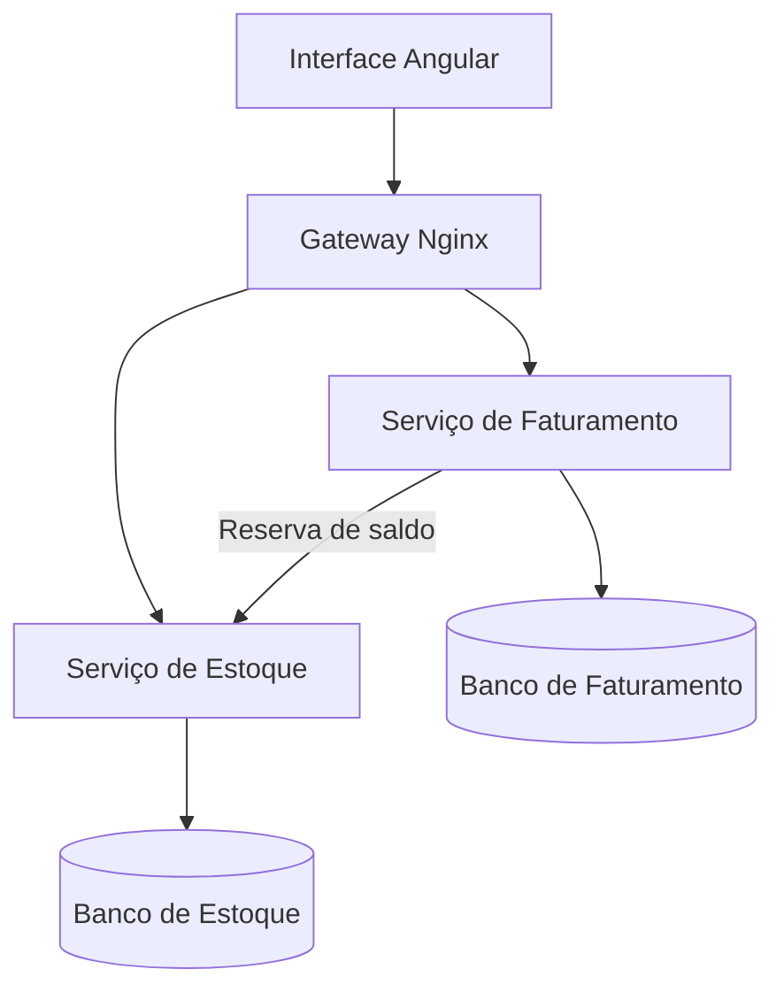

<p align="right"><a href="./README.md">English 🇺🇸</a></p>

# NotaFlow - Sistema de Notas Fiscais e Estoque

Plataforma full stack de emissão de notas fiscais desenvolvida para o desafio técnico da Korp. A solução utiliza uma interface Angular, dois microsserviços ASP.NET Core e PostgreSQL, com atenção especial à consistência, resiliência e usabilidade.

## Destaques

- Cadastro de produtos e gerenciamento de estoque
- Notas fiscais com numeração sequencial e múltiplos produtos
- Ciclo de vida com status Aberta e Fechada
- Baixa atômica do estoque durante a impressão
- Controle de concorrência para impedir estoque negativo
- Impressão idempotente, sem descontos duplicados
- Novas tentativas e retorno amigável quando o Estoque está indisponível
- Simulação interativa de falha pela interface
- Painel administrativo responsivo
- Documentação Swagger/OpenAPI nas duas APIs
- Execução com Docker Compose e CI automatizada

## Arquitetura



Cada microsserviço possui seu próprio banco. O serviço de Faturamento não altera tabelas de Estoque diretamente; a comunicação acontece pela API do serviço responsável.

## Tecnologias

- Angular 19, TypeScript e RxJS
- C# e ASP.NET Core 8
- Entity Framework Core e LINQ
- PostgreSQL 16
- Docker e Docker Compose
- Nginx
- xUnit e GitHub Actions

## Executar localmente

Requisito: Docker Desktop com Docker Compose.

```bash
cp .env.example .env
docker compose up --build
```

Acessos:

- Aplicação: `http://localhost:4200`
- Swagger do Estoque: `http://localhost:8081/swagger`
- Swagger do Faturamento: `http://localhost:8082/swagger`

Para encerrar:

```bash
docker compose down
```

Para remover também os dados locais:

```bash
docker compose down -v
```

No Windows PowerShell, crie o `.env` com `Copy-Item .env.example .env` antes de executar o Docker.

## Demonstrar a recuperação de falha

1. Cadastre um produto com saldo disponível.
2. Crie uma nota contendo esse produto.
3. Ative o **Modo de demonstração de falha** na página de notas.
4. Clique em **Imprimir**.
5. A interface informa que o Estoque está indisponível, enquanto a nota continua Aberta e o saldo permanece igual.
6. Desative o modo e imprima novamente. A nota será fechada e o estoque será descontado uma única vez.

Requisições repetidas são seguras: a chave estável `invoice-{id}` faz o Estoque reconhecer uma operação já concluída sem repetir a baixa.

## Verificações automatizadas

```bash
dotnet test Korp.InvoiceSystem.sln
cd frontend && npm ci && npm run build
```

Com o ambiente Docker em execução:

```bash
chmod +x scripts/smoke-test.sh
./scripts/smoke-test.sh
```

## Documentação

- [Detalhamento técnico](./docs/TECHNICAL_DETAILS.md)
- [Roteiro do vídeo](./docs/VIDEO_SCRIPT.md)
- [Exemplos da API](./docs/API_EXAMPLES.md)

## Segurança

- Nenhuma credencial ou dado real de usuário está versionado.
- O arquivo `.env` é ignorado; `.env.example` possui apenas valores de desenvolvimento.
- A senha de exemplo deve ser trocada fora de um ambiente local de demonstração.
- Os erros da API possuem mensagens controladas; detalhes internos ficam somente nos logs.

## Autor

Gabriel Tusi - [GitHub](https://github.com/MhrzDev) | [LinkedIn](https://www.linkedin.com/in/gabrieltusi/)

